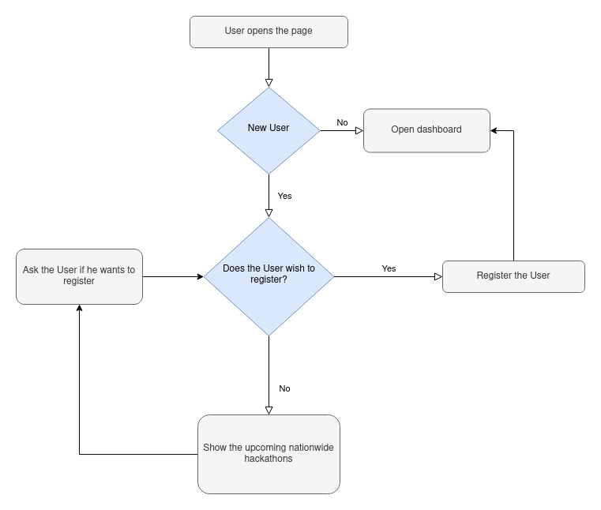

## HackCal

HackCal is a calendar which aids users who have trouble keeping track of the numerous hackathons they registered for. The application helps the user to track the dates of the hackathon and also provides other details about the hackathons.

The user can provide the application with their email address and get personal notifications about any upcomming hackathons via email. The user can choose what coding competitions he wants to get notified about by registering on the website.


## Flow Chart



## Installation and Testing instructions

1.  Download XAMPP from the [here](https://www.apachefriends.org/download.html) or any local Apache server hosting application.

2.  Make a Databased named HackCal on your MySQL server via localhost/phpmyadmin

3.  Clone the the git reposiory.

    `git clone https://github.com/Zanark/HackCal.git`

4.  Change current directory to src/HackCal/

    `cd src/HackCal/`

5.  Run all migrations

    `php artisan migrate`

6.  Host the application

    `php artisan serve`

7.  Now you can register an test user account.

8.  Admin credentials are:

    ```
    Email: admin@admin.com
    Password: password
    ```
